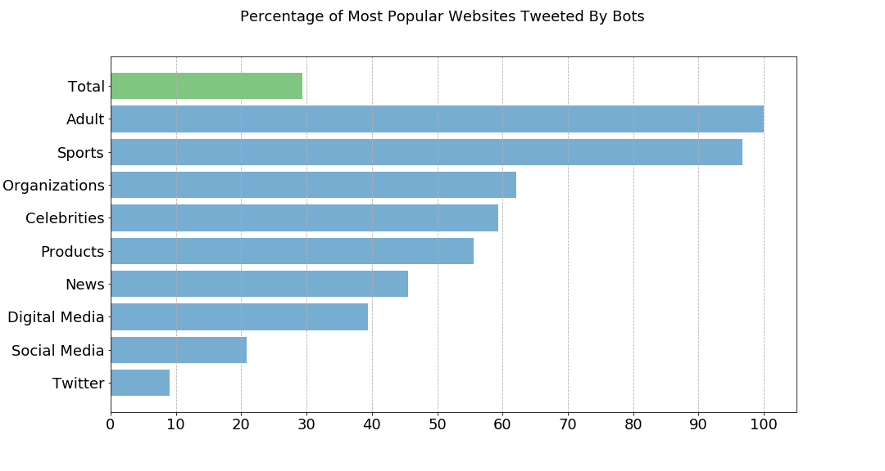

# Conclusions

Our research goal was to build a model to answer the question - Is a particular Twitter user a bot? Again, this question has grown in particular importance especially in an age where misinformation can influence politics, beliefs, or endanger lives by providing false information. Of the three models that we've developed to approach this problem, we found that the implementation of the Random Forest model on our summarized user data provided the best overall accuracy of 85% on our test data set.

In terms of our supplemental goal of discovering whether the most popular websites (e.g. top 100) in our data set was similar to the Pew Research Center's discovery of 66%, we found that only 29% of the most popular websites in our data set were tweeted by bots that our random forest model found. These differences could be attributed to many factors including the difference in how our samples were collected, the models we used for identifying bots, and the size of the data set as they were able to categorize the top 3,000 websites in their study. However, even if this result acts as a lower bound, that still means that there is still a significant amount of bots influencing what websites are tweeted.

There are several technical and experimental hurdles that our team faced during this study which has given us greater appreciation for researchers in this field. In terms of data collection, it was difficult to gather historical data from the freely available Twitter API as we cannot sample data by time slices and our processes would run into rate limits when we are downloading data. From the experimental perspective, there isn't an immediate true source that can tell a researcher whether a randomly sampled live Twitter user is a bot or not. Furthermore, the sophistication of deceptive bots will only increase as their handlers develop them to imitate human behavior in order to espouse their interests.
