# Data

Utilizing [Tweepy](http://www.tweepy.org/), a python library that wraps the [Twitter API](https://developer.twitter.com/en/docs.html), we are able to retrieve live streaming and historical twitter data. However, there are limitations to this as Twitter has [rate limits](https://developer.twitter.com/en/docs/basics/rate-limiting.html) on their free APIs.

As we are unable to get a time slice of random tweets from the Twitter API, we must find an alternative way to get obtain a data set. Using the API calls available to us, we first obtain a random sampling of accounts and then retrieve the last hundred tweets for each user.

The Twitter user information is detailed in the Twitter data dictionary [User Object](https://developer.twitter.com/en/docs/tweets/data-dictionary/overview/user-object). Below is a table describing the most pertinent fields used for our study.

| Attribute | Description |
| ------------- | -----|
| id      |  A unique identifier for a Twitter user |
| screen_name | The screen name of the Twitter user |
| description | A description of the Twitter user's account |
| verified | Whether the account is [verified](https://help.twitter.com/en/managing-your-account/twitter-verified-accounts) |
| followers_count | The number of followers of an account |
| friends_count | The number of friends of an account |
| listed_count | The number of lists that the account is a member of |
| favorites_count | The number of Tweets that a user has liked |
| statuses_count | The number of Tweets that a user has tweeted |

Tweet attributes are detailed in the Twitter data dictionary [Tweet Object](https://developer.twitter.com/en/docs/tweets/data-dictionary/overview/tweet-object). Below is a table describing some of the most pertinent fields used for our study.

| Attribute | Description |
| ------------- | -----|
| created_at | The UTC timestamp of the tweet |
| id |  A unique identifier of the tweet |
| text | The text of the tweet |
| user_id | The unique identifier of the Twitter user that tweeted this tweet |
| quote_count | The number of times this Tweet has been quoted |
| reply_count | The number of times this Tweet has been replied to |
| retweet_count | The number of times this Tweet has been retweeted |
| favorite_count | The number of times this Tweet has been favorited |
| entities.hashtags | The hashtags in the Tweet |
| entities.urls | The url links in the Tweet |
| entities.media | The media in the Tweet |
| entities.symbols | The symbols in the Tweet |

## Account Sampling and Tweet Collection

Using the streaming API, we use Twitter's [sampling](https://developer.twitter.com/en/docs/tweets/sample-realtime/overview/GET_statuse_sample.html) method to retrieve 10,000 random tweets from an equal number of unique user accounts that are described to use the English language. From this population of user accounts, we confirm that the accounts have not been suspended or are set to private before we begin downloading tweets for these accounts. Once the suspended and private accounts are filtered, we randomly select 1,000 Twitter accounts and download the last 100 tweets from each account.

We obtain the last 100 tweets as opposed to a date range because it is difficult to retrieve time slices because a direct option is not available. Furthermore, if the free API is used to retrieve historical user tweet data, it must iterate from an account's latest tweets which in turn sets off rate limits on especially prolific Twitter users as we search for a specific time slice. As a result, our team acknowledges that the last 100 tweets between each account may cross different time spans but we must work within technical limitations of the free API.

## Website Classification

In an effort to replicate the Pew Research Center's findings on the percentage of the 'most popular' websites which are the top 2,315 tweeted websites in their data set (citation needed) and their associated categorical breakdown were tweeted by bots, we find the top 100 websites in our dataset and manually categorize them. The categories used by the Pew Research Center's study include: Adult Content, Sports, Commercial Products & Services, News and Current Events, Celebrities, Organizations, and redirects to Twitter.com. However, we include the additional categories of Other Social Media (e.g. Imgur, Facebook, Linkedin, etc.) and Digital Media (e.g. Twitch, YouTube, Spotify) as they don't fall in line with the study's existing categories and its methodology isn't clear how these are categorized. (Citations!)

## Natural Language Processing

We used the Natural Language Processing (NLP) [spaCy](https://spacy.io/) library.  We used the `en_core_web_sm` statistical [model](https://spacy.io/models/en#en_core_web_sm) which is suited for analyzing web content.

This library allowed us to identify the named entities in the text of the tweets. A named entity is a real world object. These are named entities we decided to include for NLP processing, specifying spaCy's entity type:

- **PERSON**: People, including fictional.
- **NORP**: Nationalities or religious or political groups.
- **ORG**: Companies, agencies, institutions, etc.
- **GPE**: Countries, cities, states.
- **PRODUCT**: Objects, vehicles, foods, etc. (Not services.)
- **LAW**: Named documents made into laws.
- **MONEY**: Monetary values, including unit.

In our analysis below, we identified which of these named entities we should include in our models.

## Modeling Dataset Augmentation

In order to process the tweet data for a given account, we perform an aggregation or scoring on it and then roll it up to the account level for modeling. The following are aggregate tweet metrics we will use as predictors for our modeling.

* Tweets per Hour of Day
* Average Number of Links per Tweet
* Average Tweet Status Word Length per Tweet
* Average Number of Hashtags per Tweet
* Average User Mentions per Tweet
* Average Favorite Count per Tweet
* Average Media Count per Tweet
* Average Symbol Count per Tweet
* Average Retweet Count per Tweet
* Average Number of Truncated Tweets
* Total Top 100 Website Category Links
* Retweet Ratio
* Natural Language Processing named entities

# Exploratory Data Analysis

## User Level Exploratory Data Analysis

### Bots vs Non Bots

In the above histogram of Twitter user accounts by Botometer score, our team uses the Pew Research Center's Botometer score threshold of 0.43 to determine whether a user is a bot. Our work finds that our data yields 851 non-bot and 149 bot users which translates to approximately 17% of the sample are bots.

### Distribution of Account Level Attributes

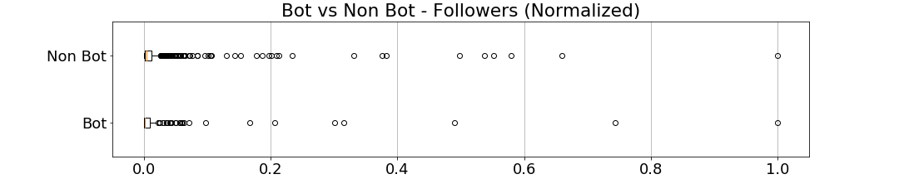

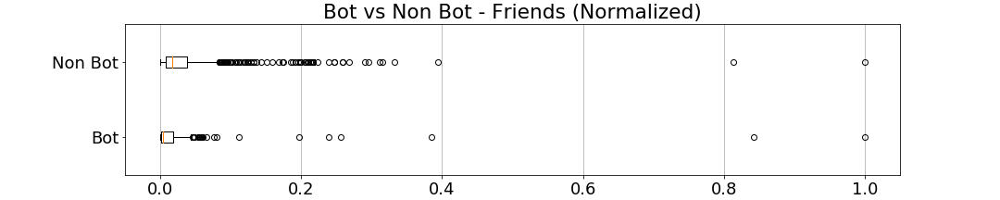

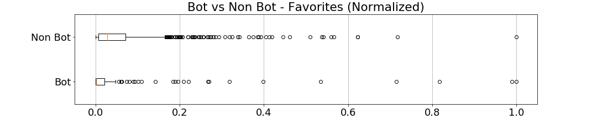

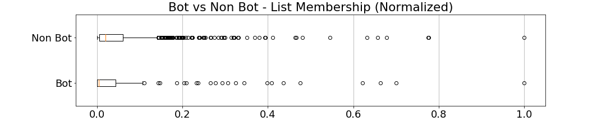

In the above normalized boxplots of Twitter user attributes, our study observes the following:
* The median for non-bot is higher compared to bot users across all attributes: total statuses, followers, friends, favorites, and list memberships.
* For both bot and non-bot users for all examined attributes, the distance between the median and upper quartile is larger than the distance between the median and lower quartile indicating higher variability between the median and the upper quartile when compared to the median and lower quartile.
* We also notice that the box between the upper and lower quartile and the distance from the upper quartile to the upper whisker for non bot users for all examined attributes are longer than that of bot users indicating that there is more variability within the examined attributes.
* Lastly, for both bots and not-bots, we observe the existence of many outliers beyond the upper whiskers of the boxplot.

## Tweet Level Exploratory Data Analysis

### Tweet Attributes Probability Mass Function Plots

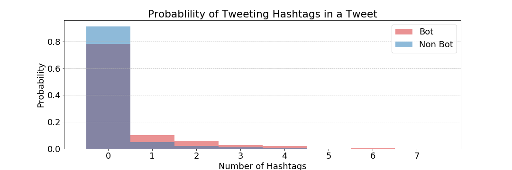

We observe in the above PMF plot that both bots and non-bots have a similar shape in their probabilities of tweeting with a hashtag. However, non-bots have a higher probability of Tweeting with zero hashtags when compared to bots while bots have a higher probability of tweeting with more than one hashtag compared to non-bots.

The above PMF plot illustrates that both bots and non-bots have a similar shape in their probabilities that their tweet will be retweeted. Aside from bots having a higher likelihood of tweet not retweeted when compared to non-bots, there isn't a clear difference in probabilities when a tweet is retweeted by more one or more users.

The above PMF plot illustrates that both bots and non-bots have a similar shape in their probabilities of tweeting a user mention. Bots have a clear higher probability not tweeting a user mention compared to non-bots while non-bots are more likely to tweet one user mention than a bot. For tweets with user mentions greater than one, bots have a slightly higher probability than non bots.

The above PMF plot illustrates that both bots and non-bots have a similar shape in their probabilities of tweeting a link. Non bots are more likely than bots to tweet zero links while bots are more likely to tweet one or more links when compared to non-bots.

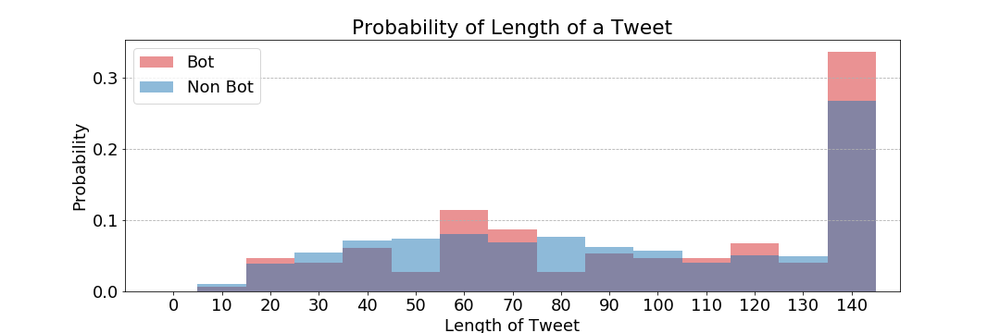

The above PMF plot shows a more normal even distribution for the probability of a given Tweet length for non bots when compared to bots which has multiple peaks and valleys. However, both have another large peak at the maximum twitter length at 140 characters.

### Average Number of Tweets vs Hour

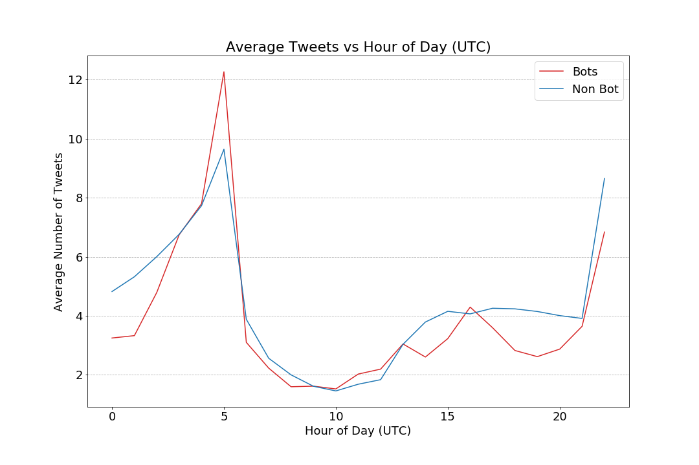

The Average Number of Tweets for a given Hour of Day (UTC) shows that bots and non-bots appear to show similar tweeting patterns with a peak at 5:00 UTC which corresponds to 12:00AM EST and around 24:00 UTC which corresponds to 7:00PM EST. This is in contrast to our initial hypothesis where we expected bots to tweet more uniformly across the day. However, it may be that more sophisticated bots may try to imitate human behavior and also peak at times of high human traffic in order to increase the chances of their tweet being seen and to avoid possible suspension.  We needed to clean this data. We took the UTC time, extracted the hour into a new `created_at_hour` column.

### Natural Language Based Metrics

To make NLP faster, we first manually processed the text of the tweet through:

- Removed user references, hashtags, and other twitter special words.
- Removed URLs.

The cleaned text was stored in a new `clean_text` column.

We then processed the `clean_text` using spaCy and stored the captured named entities in a new `named_entities` column.  This column was used to identify and calculate the means that we stored in columns beginning with `mean_ref_to_{named_entity}`.

> The following histograms for NLP metrics may require a note on interpretation. The data points we are investigating are the percentage of time when a user creates a tweet they reference a named entity. 
>
>The histogram is adjusted to show a PMF of the bins. To read the histogram, the x axis is showing the middle value of the bin, for instance, at 0.2, it is representing 15-25% of the user's tweets include a reference to the named entity.  
>
>The bin represents the probability that any given user will tweet with a reference to a named entity the described percent of the time.

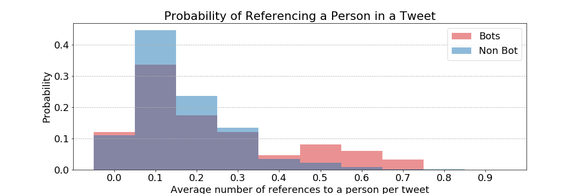

The probability that a bot will include references to people in tweets trends higher than than non-bots.  Most bots and non-bots tend to reference people between 10% and 30% of the time in their tweets. However, in our data set there is a small probability that bots that tweet will reference to people 50% to 70% of the time. 

Most of the users, bots and non-bots in our data set do not reference a nationality, religious or political groups. About twenty percent of users have references 10% of the time.

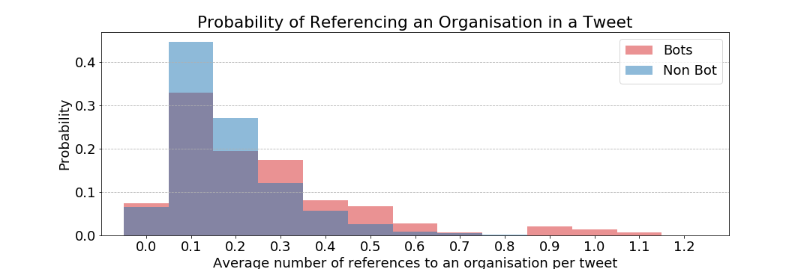

Companies, agencies, and institutions are often referenced in tweets in our data set. There is a over 40% chance that a non-bot user will create a tweet with a reference 10% of the time.  Interesting, a small set of bots will tweet a reference to an organization in every tweet.

About 70% of the time a bot or non-bot will average referencing a country, city, or state in a tweet 10% or more of the time. One again, bots tend to trend higher than non-bots with references.

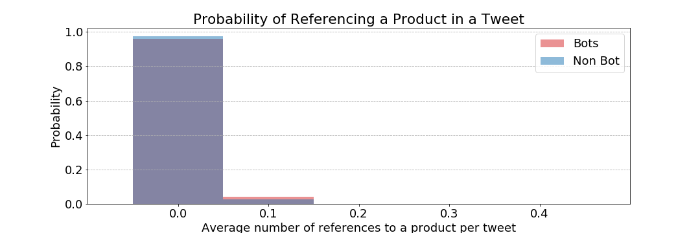

Both bots and non-bots in our data set tend not to reference a product when tweeting. However, when looking at users that do reference products, which is very low probability that this will occur, more bots than non-bots will reference products at most 10% of the time.

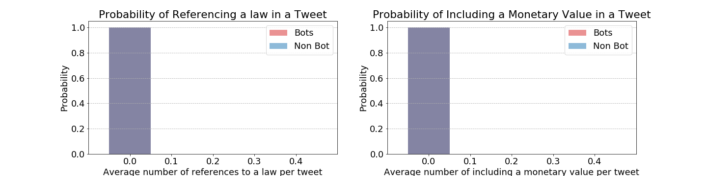

We did not include NLP metrics for Law and Money because the spaCy model found zero references to them in our tweets. 

Examining the above NLP PMF plots, we see that bots have a higher probability of having tweets that on average reference to an entity such as organization, location, product, nationality, and person.
