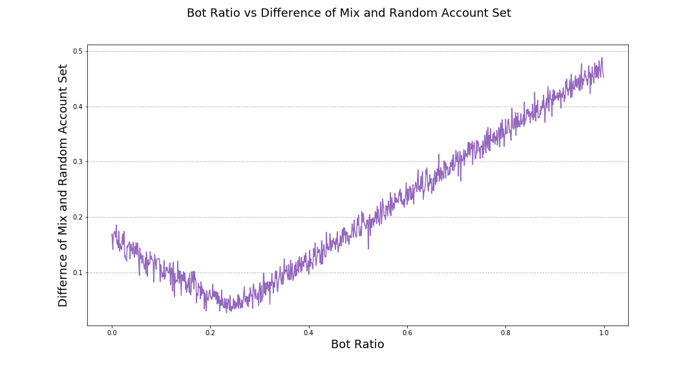

# Modeling Approach and Results

## Botometer Universal Score Threshold

As there are few complete data sets of known and active bots, especially those that are used for deception, we will use Botometer's universal bot score as a source of truth for training our models. Models were built based on dataset of 1000 random twitter accounts (random set) as described in the [Account Sampling and Tweet Collection](data_and_eda.md). Those accounts are classified as bot and non-bot based on Botometers universal score (0-1) with a higher score indicating that a Twitter account is more likely a bot.     

Since the division of bot is essentially for this project. For better estimating, we access 936 self-identified bot accounts (bot sets) from [Botwiki](http://botwiki.org), and 1000 manually collected human verified accounts (human set). The Kolmogorov-Smirnov statistic on two samples showed that, the distribution of Botometers universal score for the random set is significantly different from both the human set (p value = 4.2e-11) and bot set (4.2e-92). This finding suggested that the random set includes both human and bot accounts.


Further analysis estimates that the ratio of bots in the random set is 23.4%. Using this ratio, we rebuilt a new set of account mixed with known bot and human accounts. Using Logistic regression modeling on this mixed set indicated that a threshold of 0.47 provides us with the best performance to divide bot accounts from non-bot accounts.




The bot threshold we found in our analysis is within Botometers suggested range. In the Pew Research Centers study it stated that, "Prior work by the Botometer team found thresholds between 0.43 and 0.49 maximized accuracy – the total number of correctly classified accounts divided by the total number of accounts"<sup>[1](lit_review.html)</sup>. Furthermore, "According to the authors of Botometer, a threshold at or near 0.50 is appropriate for some automated accounts, but works more effectively on older, less-sophisticated bot programs. For more modern, sophisticated automated accounts, a threshold of 0.43 has been shown to maximize the accuracy of the system"<sup>[1](lit_review.html)</sup>. We consequently decided to use the Pew Research Centers threshold of 0.43 as the Botwiki self-identified bots are primarily less sophisticated whose primary purpose is not to deceive.

## Approach

In our modeling of the 1000 random twitter accounts, our team used a Botometer score of 0.43 or higher to declare that an account is a bot (149 accounts). The Tweet metrics we will use as predictors for our modeling including the following attributes:

| favourites_count | followers_count | friends_count |
| listed_count | tweets_per_hour | mean_links_per_tweet |
| mean_words_per_tweet | mean_hashtags_per_tweet | mean_user_mentions_per_tweet |
| mean_favourites_per_tweet |  mean_media_per_tweet | mean_user_symbols_per_tweet |
| mean_retweets_per_tweet | mean_truncations_per_tweet | mean_links_to_twitter|
| mean_links_to_top_social_media| mean_links_to_top_digital_media| mean_links_to_top_news|
| mean_links_to_top_products_services| mean_links_to_top_celebrities| mean_links_to_top_organizations|
| mean_links_to_top_sports| mean_links_to_top_adult| retweet_ratio |
| mean_ref_to_person| mean_ref_to_norp| mean_ref_to_org|
| mean_ref_to_gpe| mean_ref_to_product| mean_ref_to_law|
| mean_ref_to_money| default_profile | default_profile_image|
| geo_enabled | has_extended_profile| is_translation_enabled|
| profile_background_tile| profile_use_background_image| verified |

All accounts are randomly split between the train and test data set (test ratio: 0.2). All models are trained with train data set with 5-fold cross-validation, and then tested on test data set. Since we have highly imbalanced account number of bot and nun-bot (~ 1: 6.5), we increase the class weight to achieve the comparable accuracy of prediction on bot and non-bot.

The classification models that we chose to implement for our study include multiple logistical regression, bagging decision tree, and a random forest. We chose these models in order of complexity to determine whether the additional sophistication of the model aids in finding a more accurate result.

## Multiple Logistic Regression (Cross-validated)


In order to train a Multiple Logistic model, the below code creates a model with our training set using 5-fold cross validation and class weights that represent our bot to non-bot ratio. The performance function runs the model against our test data set and outputs out the accuracy statistics.

```python
LR_model = LogisticRegressionCV(Cs = 10,
                                cv = 5, 
                                max_iter = 1000, 
                                class_weight = {0:1,1:7}).fit(X_train,
                                                              y_train)
performance(LR_model, X_train, X_test)
```

With multiple logistic regression, after tuning the weight of bot, we achieve a model with performance as:
* Training Set Total Accuracy: 68.38%
* Training Set Non-bot Accuracy: 67.89%
* Training Set Bot Accuracy: 71.19%
* Test Set accuracy: 66.00%
* Test Set Non-bot Accuracy: 65.90%
* Test Set Bot Accuracy: 66.67%

## Bagging Decision Tree

A bagging decision tree is an ensemble model that performs multiple bootstrap decision tree and combines the results to get an overall classification.

The below code computes our cut-off for the bagging tree.


Informed by the data above, we implement our bagging model for the test prediction.

```python
#Select overfit tree depth
tree_depth = 10
#Set number of trees
n_trees = 51

#Conduct bootstrapping and fit models to the date
np.random.seed(0)
bagging_train = np.zeros((X_train.shape[0], n_trees))
bagging_test = np.zeros((X_test.shape[0], n_trees))
bagging_models = []
for i in range(n_trees):
    bootstrapped_X, bootstrapped_y = resample(X_train, y_train)
    fitted_model = DecisionTreeClassifier(max_depth=tree_depth, 
                                          class_weight = {0:1,1:1}).fit(bootstrapped_X, 
                                                                        bootstrapped_y)
    bagging_models.append(fitted_model)
    bagging_train[:,i] = fitted_model.predict(X_train)
    bagging_test[:,i] = fitted_model.predict(X_test)

#Get Predictions across all models
y_pred_train = np.mean(bagging_train, axis=1) > .2
y_pred_test = np.mean(bagging_test, axis=1) > .2
```

With bagging decision tree, increasing bot weight did not improve the bot accuracy. After tuning the cut off and using the optimal number of trees (51), we achieve a model with performance as:
* Training Set Total Accuracy: 97.5%
* Training Set non-bot Accuracy: 97.21%
* Training Set bot Accuracy: 99.15%
* Test Set Accuracy: 85.5%
* Test Set Non-bot Accuracy: 85.80%
* Test Set Bot Accuracy: 83.87%

## Random Forest

Random Forest like the Bagging Decision Tree is a also an ensemble model. Although it includes bootstrapping as part of its implementation, It differs from the bagging model in that it uses a random subset of predictors for its modelling to correct for overfitting.


Using the analysis above, we use the following model to predict against our test set.

```python
tree_depth = 5
n_trees = 50
RF_model = RandomForestClassifier(n_estimators=n_trees, 
                                  max_depth=tree_depth,
                                  class_weight = {0:1,1:20}).fit(X_train,
                                                                 y_train)
performance(RF_model,X_train,X_test)
```

With random forest, after tuning the weight of bot and tree depth, we achieve a model with performance as:
* Training Set total Accuracy: 91.50%
* Training Set Non-bot Accuracy: 90.24%
* Training Set bot Accuracy: 100.00%
* Test Set Accuracy: 85.00%
* Test Set Non-bot Accuracy: 84.97%
* Test Set bot Accuracy: 85.19%
